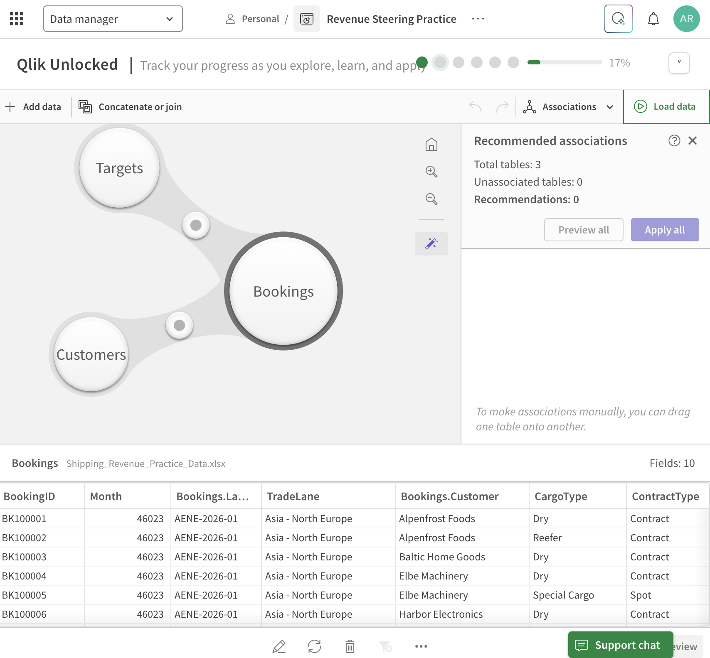
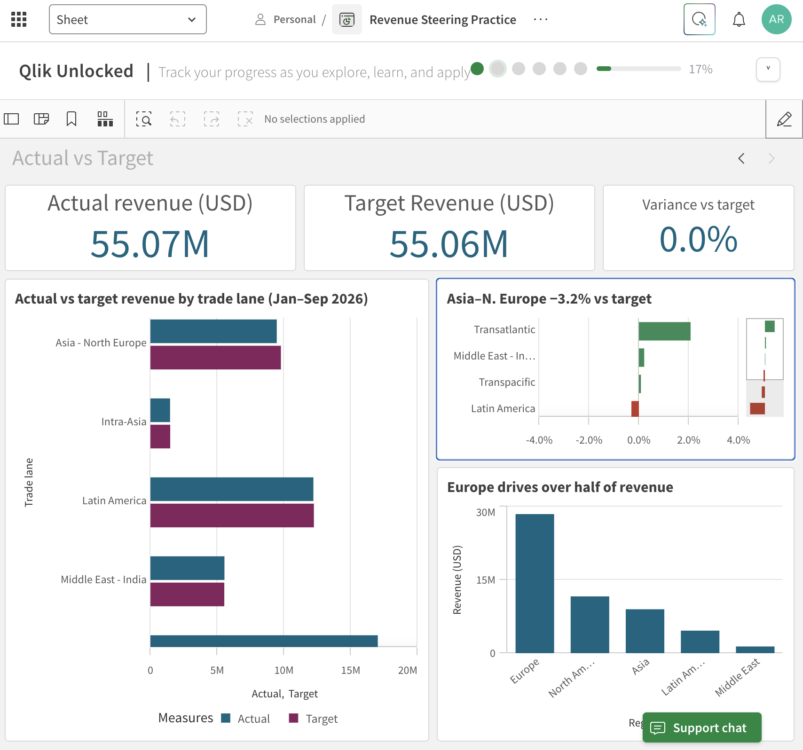

# Qlik Sense Revenue Steering Dashboard

Hands-on learning project: building a revenue steering dashboard for a container shipping business in **Qlik Sense (Qlik Cloud)** — from raw data to management-ready insights.

> **Note:** All data in this project is **fictional practice data** created for learning. Company names, volumes and rates are invented and do not represent any real company.

---

## Business questions

A revenue steering team needs to answer, at a glance:

1. How much did we ship and earn (Jan–Sep 2026)?
2. Which trade lanes and cargo types drive revenue?
3. Are we on target — and where are the gaps?
4. Are sales teams adopting a new quotation tool?

Core logic: **Revenue = Volume (TEU) × Rate (USD per TEU)**, shaped by **mix** (lane, customer, cargo type).

---

## Data model

Source: [`data/Shipping_Revenue_Practice_Data.xlsx`](data/Shipping_Revenue_Practice_Data.xlsx)

| Table | Rows | Description | Links to |
|---|---|---|---|
| Bookings | 327 | Month × trade lane × customer × cargo type, with TEU and rate per TEU | Customers (Customer), Targets (LaneMonthKey) |
| Customers | 15 | Region and segment per customer | Bookings, CampaignAdoption (Region) |
| Targets | 54 | Monthly revenue target per trade lane | Bookings |
| CampaignAdoption | 65 | Weekly adoption of a new quotation tool by region | Customers |

---

## Roadmap

| # | Project | Status |
|---|---|---|
| 0 | Qlik Cloud setup, upload data | ✅ Done |
| 1 | First app: KPIs, revenue by trade lane, filters | ✅ Done |
| 2 | Data model: link Customers + Targets, actual vs target | ✅ Done |
| 3 | Revenue Steering dashboard (3 sheets, master items, set analysis) | ⏳ Planned |
| 4 | Campaign adoption report | ⏳ Planned |
| 5 | Storytelling: bookmarks, Qlik story, export to Excel / PowerPoint | ⏳ Planned |

---

## Project 1 — First app: Bookings overview

**Goal:** load booking data and build a first overview sheet with KPIs, a breakdown by trade lane and filters.

### What I did

1. Created a Qlik Cloud app and loaded the **Bookings** table.
2. **Fixed a data type issue:** the Excel month column loaded as a serial number (`46023`). Created a calculated field so months display as real dates:
   ```
   BookingMonth = Date(MonthStart(Month), 'MMM YYYY')
   ```
3. Built three KPIs:

   | KPI | Expression |
   |---|---|
   | Total TEU | `Sum(TEU)` |
   | Revenue (USD) | `Sum(TEU * RatePerTEU_USD)` |
   | Avg revenue per TEU (USD) | `Sum(TEU * RatePerTEU_USD) / Sum(TEU)` |

4. Built a **bar chart** — Revenue by trade lane, sorted descending.
5. Added a **filter pane** for CargoType and BookingMonth.
6. Cleaned labels and sorting to make the sheet management-ready.

### Screenshots

**Overview (no selection)**


**Reefer selected**


**Data manager — calculated date field**


### Results

| | All cargo | Reefer |
|---|---|---|
| Total TEU | 32.58k | 6.58k |
| Revenue (USD) | 55.07M | 14.98M |
| Avg revenue per TEU | ~1,691 | ~2,278 |

### Key insight

**Reefer is ~20% of containers but ~27% of revenue.** Each reefer container earns about **35% more** than the average container, and reefer volume is concentrated on four lanes (Latin America, Transatlantic, Asia–North Europe, Middle East–India). Mix matters as much as volume.

### What I learned

- Dimensions vs measures, and aggregation (`Sum`)
- Writing expressions — multiply row by row first, then sum
- Fixing data types with a calculated field
- Qlik's associative selections (green / white / grey)
- Edit mode vs analysis mode; labels and sorting for management readers

---

## Project 2 — Data model: actual vs target

**Goal:** link three tables into one data model and answer the steering question *"Did we hit target — and where not?"*

### What I did

1. Added the **Customers** and **Targets** tables to the app.
2. **Associated the tables** in the Data manager on their shared keys — a star-schema-style model with Bookings (facts) in the centre:

   ```
   Targets ──(LaneMonthKey)── Bookings ──(Customer)── Customers
   ```

3. Built a new sheet **Actual vs Target** with three KPIs:

   | KPI | Expression |
   |---|---|
   | Actual revenue (USD) | `Sum(TEU * RatePerTEU_USD)` |
   | Target revenue (USD) | `Sum(TargetRevenue_USD)` |
   | Variance vs target | `Sum(TEU * RatePerTEU_USD) / Sum(TargetRevenue_USD) - 1` |

4. **Actual vs target by trade lane** — grouped horizontal bar chart.
5. **Variance % by trade lane** — sorted best to worst, coloured with an expression (green = above target, red = below):
   ```
   If(Sum(TEU * RatePerTEU_USD) / Sum(TargetRevenue_USD) - 1 < 0, '#C0392B', '#2E8B57')
   ```
6. **Revenue by customer region** — only possible because of the Customer link (Region lives in Customers, revenue in Bookings).
7. Wrote **action titles** that state the conclusion, e.g. *"Asia–N. Europe −3.2% vs target"*.

### Screenshots

**Data model — three associated tables**


**Actual vs Target sheet**


### Results

| Trade lane | Actual (USD) | Target (USD) | Variance |
|---|---|---|---|
| Transatlantic | 17.03M | 16.68M | **+2.1%** |
| Middle East – India | 5.54M | 5.53M | +0.2% |
| Transpacific | 9.36M | 9.35M | +0.1% |
| Latin America | 12.20M | 12.24M | −0.3% |
| Intra-Asia | 1.47M | 1.48M | −0.7% |
| Asia – North Europe | 9.46M | 9.77M | **−3.2%** |
| **Total** | **55.07M** | **55.06M** | **0.0%** |

### Key insights

- **The total hides the story.** Overall revenue is exactly on target (0.0%), but lanes range from **+2.1% (Transatlantic)** to **−3.2% (Asia – North Europe)**. Without the lane breakdown, a ~$300k shortfall on Asia – North Europe would go unnoticed.
- **Europe-based customers generate over half of revenue** (~28.5M of 55M), followed by North America (~11.6M).
- **Chart choice changes the message.** In the grouped actual-vs-target chart all bars look nearly equal; the variance chart makes the gap obvious in one second.

### What went wrong and how I fixed it

1. **A table disappeared before loading.** When adding Customers and Targets from the same Excel file, I unticked Bookings because it was "already loaded". In Qlik's *Add data* dialog, the ticked tables define *everything* the app will contain from that file — unticking means **delete**. The Data manager showed Bookings as *"deleted, will be removed at next reload"*. Because changes only apply on **Load data**, nothing was lost yet: I re-added all three tables, verified the field count (10 incl. the calculated `BookingMonth`), and only then loaded.
   *Lesson: always review pending changes before loading — like reviewing a diff before deploying.*
2. **Fields were renamed automatically** (`Bookings.Customer`, `Bookings.LaneMonthKey`). Qlik *qualifies* field names so tables don't link without approval. I applied the recommended associations explicitly and confirmed *Unassociated tables: 0*.
3. **Stacked vs grouped bars.** Switching the chart to horizontal accidentally made it **stacked**, adding actual + target into a meaningless 35M+ bar. Fixed by switching back to **grouped**.
   *Lesson: stacked = parts of a whole; grouped = comparison.*
4. **Hidden categories.** Charts with too little space showed only 4 of 6 lanes behind a scrollbar — including hiding the worst performer. Fixed by resizing so every lane is visible.
5. **Regression check.** After changing the data model, I re-checked the Project 1 sheet to confirm its KPIs still showed the same values.

### What I learned

- Associations, keys and a star-schema data model
- Measures that combine tables (`TargetRevenue_USD` from Targets, revenue from Bookings)
- Variance % and expression-based colours (`If()` + hex colour codes)
- Number formatting (percentages), custom sorting, grouped vs stacked charts
- Action titles and layout checks for management readers

## Project 3 — Revenue Steering dashboard

*Coming soon.*

## Project 4 — Campaign adoption report

*Coming soon.*

## Project 5 — Storytelling and export

*Coming soon.*

---

## Tools

Qlik Sense (Qlik Cloud Analytics) · Excel · PowerPoint

**Author:** Aravind Radhakrishnan — M.Sc. IT Engineering student, FH Wedel · [LinkedIn](https://www.linkedin.com/in/aravind-radhakrishnan-6679ab209)
