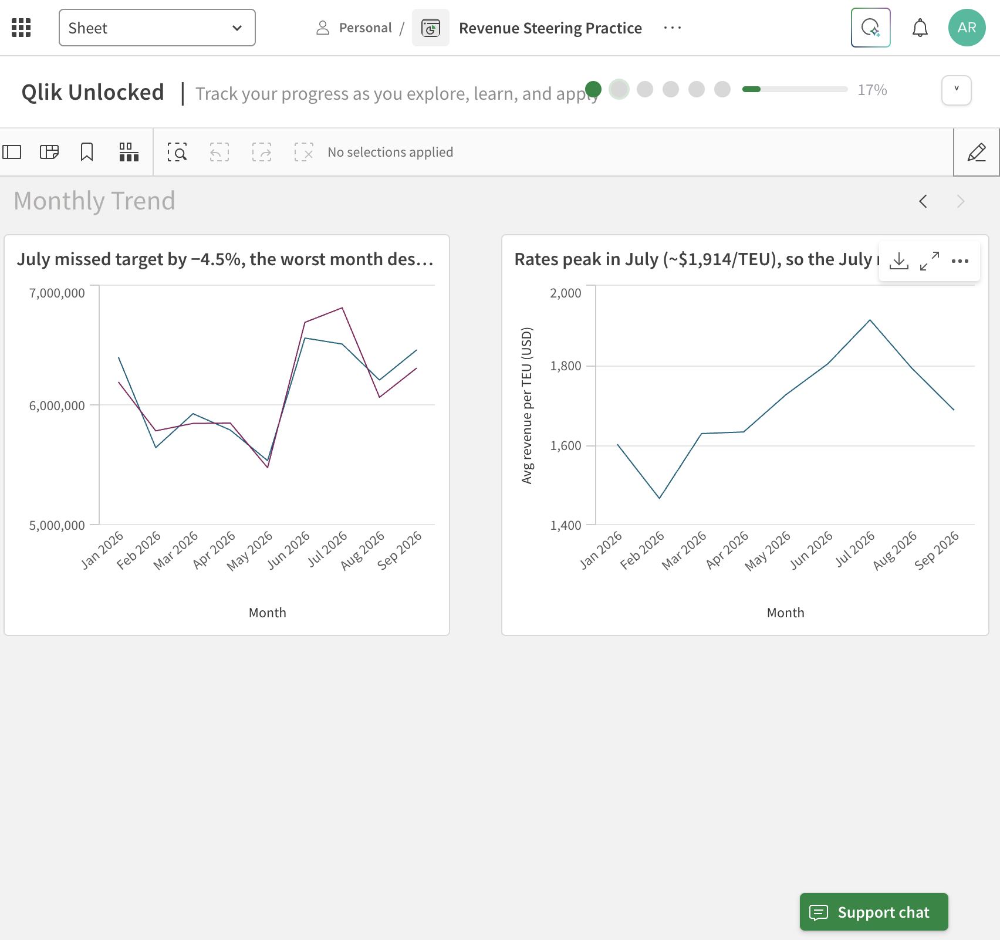
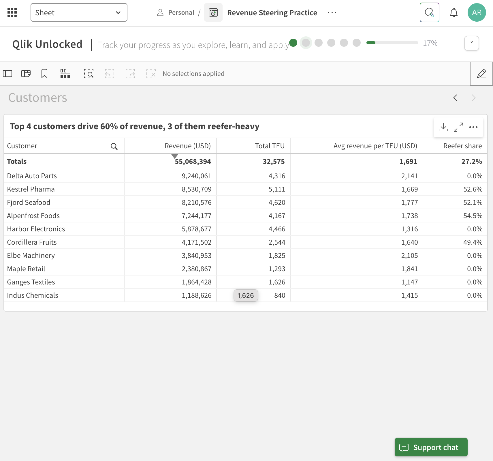
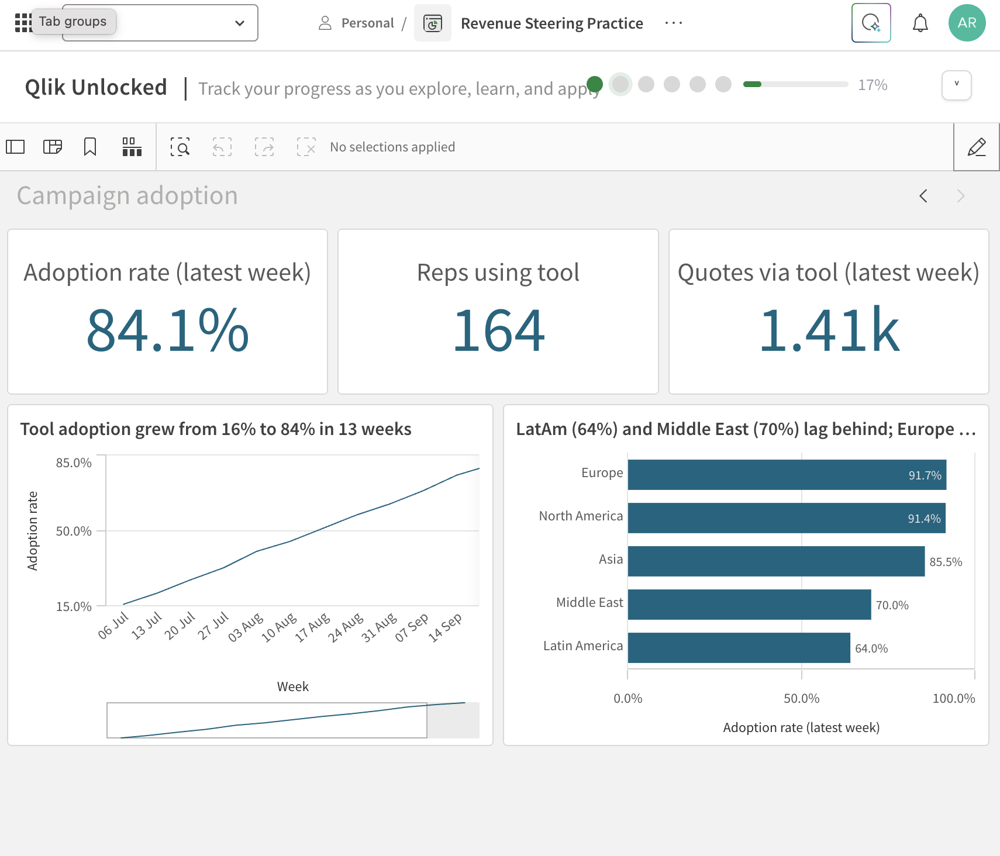

# Qlik Sense Revenue Steering Dashboard

Hands-on learning project: building a revenue steering dashboard for a container shipping business in **Qlik Sense (Qlik Cloud)** — from raw data to management-ready insights.

> **Note:** All data in this project is **fictional practice data** created for learning. Company names, volumes and rates are invented and do not represent any real company.

---

## Business questions

A revenue steering team needs to answer, at a glance:

1. How much did we ship and earn (Jan–Sep 2026)?
2. Which trade lanes and cargo types drive revenue?
3. Are we on target — and where are the gaps?
4. Are sales teams adopting a new quotation tool?

Core logic: **Revenue = Volume (TEU) × Rate (USD per TEU)**, shaped by **mix** (lane, customer, cargo type).

---

## Data model

Source: [`data/Shipping_Revenue_Practice_Data.xlsx`](data/Shipping_Revenue_Practice_Data.xlsx)

| Table | Rows | Description | Links to |
|---|---|---|---|
| Bookings | 327 | Month × trade lane × customer × cargo type, with TEU and rate per TEU | Customers (Customer), Targets (LaneMonthKey) |
| Customers | 15 | Region and segment per customer | Bookings, CampaignAdoption (Region) |
| Targets | 54 | Monthly revenue target per trade lane | Bookings |
| CampaignAdoption | 65 | Weekly adoption of a new quotation tool by region | Customers |

---

## Roadmap

| # | Project | Status |
|---|---|---|
| 0 | Qlik Cloud setup, upload data | ✅ Done |
| 1 | First app: KPIs, revenue by trade lane, filters | ✅ Done |
| 2 | Data model: link Customers + Targets, actual vs target | ✅ Done |
| 3 | Revenue Steering dashboard (master items, monthly trend, set analysis) | ✅ Done |
| 4 | Campaign adoption report | ✅ Done |
| 5 | Storytelling: bookmarks, Qlik story, export to Excel / PowerPoint | ⏳ Planned |

---

## Project 1 — First app: Bookings overview

**Goal:** load booking data and build a first overview sheet with KPIs, a breakdown by trade lane and filters.

### What I did

1. Created a Qlik Cloud app and loaded the **Bookings** table.
2. **Fixed a data type issue:** the Excel month column loaded as a serial number (`46023`). Created a calculated field so months display as real dates:
   ```
   BookingMonth = Date(MonthStart(Month), 'MMM YYYY')
   ```
3. Built three KPIs:

   | KPI | Expression |
   |---|---|
   | Total TEU | `Sum(TEU)` |
   | Revenue (USD) | `Sum(TEU * RatePerTEU_USD)` |
   | Avg revenue per TEU (USD) | `Sum(TEU * RatePerTEU_USD) / Sum(TEU)` |

4. Built a **bar chart** — Revenue by trade lane, sorted descending.
5. Added a **filter pane** for CargoType and BookingMonth.
6. Cleaned labels and sorting to make the sheet management-ready.

### Screenshots

**Overview (no selection)**


**Reefer selected**


**Data manager — calculated date field**


### Results

| | All cargo | Reefer |
|---|---|---|
| Total TEU | 32.58k | 6.58k |
| Revenue (USD) | 55.07M | 14.98M |
| Avg revenue per TEU | ~1,691 | ~2,278 |

### Key insight

**Reefer is ~20% of containers but ~27% of revenue.** Each reefer container earns about **35% more** than the average container, and reefer volume is concentrated on four lanes (Latin America, Transatlantic, Asia–North Europe, Middle East–India). Mix matters as much as volume.

### What I learned

- Dimensions vs measures, and aggregation (`Sum`)
- Writing expressions — multiply row by row first, then sum
- Fixing data types with a calculated field
- Qlik's associative selections (green / white / grey)
- Edit mode vs analysis mode; labels and sorting for management readers

---

## Project 2 — Data model: actual vs target

**Goal:** link three tables into one data model and answer the steering question *"Did we hit target — and where not?"*

### What I did

1. Added the **Customers** and **Targets** tables to the app.
2. **Associated the tables** in the Data manager on their shared keys — a star-schema-style model with Bookings (facts) in the centre:

   ```
   Targets ──(LaneMonthKey)── Bookings ──(Customer)── Customers
   ```

3. Built a new sheet **Actual vs Target** with three KPIs:

   | KPI | Expression |
   |---|---|
   | Actual revenue (USD) | `Sum(TEU * RatePerTEU_USD)` |
   | Target revenue (USD) | `Sum(TargetRevenue_USD)` |
   | Variance vs target | `Sum(TEU * RatePerTEU_USD) / Sum(TargetRevenue_USD) - 1` |

4. **Actual vs target by trade lane** — grouped horizontal bar chart.
5. **Variance % by trade lane** — sorted best to worst, coloured with an expression (green = above target, red = below):
   ```
   If(Sum(TEU * RatePerTEU_USD) / Sum(TargetRevenue_USD) - 1 < 0, '#C0392B', '#2E8B57')
   ```
6. **Revenue by customer region** — only possible because of the Customer link (Region lives in Customers, revenue in Bookings).
7. Wrote **action titles** that state the conclusion, e.g. *"Asia–N. Europe −3.2% vs target"*.

### Screenshots

**Data model — three associated tables**


**Actual vs Target sheet**


### Results

| Trade lane | Actual (USD) | Target (USD) | Variance |
|---|---|---|---|
| Transatlantic | 17.03M | 16.68M | **+2.1%** |
| Middle East – India | 5.54M | 5.53M | +0.2% |
| Transpacific | 9.36M | 9.35M | +0.1% |
| Latin America | 12.20M | 12.24M | −0.3% |
| Intra-Asia | 1.47M | 1.48M | −0.7% |
| Asia – North Europe | 9.46M | 9.77M | **−3.2%** |
| **Total** | **55.07M** | **55.06M** | **0.0%** |

### Key insights

- **The total hides the story.** Overall revenue is exactly on target (0.0%), but lanes range from **+2.1% (Transatlantic)** to **−3.2% (Asia – North Europe)**. Without the lane breakdown, a ~$300k shortfall on Asia – North Europe would go unnoticed.
- **Europe-based customers generate over half of revenue** (~28.5M of 55M), followed by North America (~11.6M).
- **Chart choice changes the message.** In the grouped actual-vs-target chart all bars look nearly equal; the variance chart makes the gap obvious in one second.

### What went wrong and how I fixed it

1. **A table disappeared before loading.** When adding Customers and Targets from the same Excel file, I unticked Bookings because it was "already loaded". In Qlik's *Add data* dialog, the ticked tables define *everything* the app will contain from that file — unticking means **delete**. The Data manager showed Bookings as *"deleted, will be removed at next reload"*. Because changes only apply on **Load data**, nothing was lost yet: I re-added all three tables, verified the field count (10 incl. the calculated `BookingMonth`), and only then loaded.
   *Lesson: always review pending changes before loading — like reviewing a diff before deploying.*
2. **Fields were renamed automatically** (`Bookings.Customer`, `Bookings.LaneMonthKey`). Qlik *qualifies* field names so tables don't link without approval. I applied the recommended associations explicitly and confirmed *Unassociated tables: 0*.
3. **Stacked vs grouped bars.** Switching the chart to horizontal accidentally made it **stacked**, adding actual + target into a meaningless 35M+ bar. Fixed by switching back to **grouped**.
   *Lesson: stacked = parts of a whole; grouped = comparison.*
4. **Hidden categories.** Charts with too little space showed only 4 of 6 lanes behind a scrollbar — including hiding the worst performer. Fixed by resizing so every lane is visible.
5. **Regression check.** After changing the data model, I re-checked the Project 1 sheet to confirm its KPIs still showed the same values.

### What I learned

- Associations, keys and a star-schema data model
- Measures that combine tables (`TargetRevenue_USD` from Targets, revenue from Bookings)
- Variance % and expression-based colours (`If()` + hex colour codes)
- Number formatting (percentages), custom sorting, grouped vs stacked charts
- Action titles and layout checks for management readers

---

## Project 3 — Revenue Steering dashboard

**Goal:** turn the app into a reusable steering dashboard — consistent KPI definitions, a monthly view of actual vs target, and a customer view — answering *"When did we miss, why, and which customers matter most?"*

### What I did

1. **Created master items** — one central definition per KPI, reused in every chart ("one version of the truth"):

   | Master item | Type | Definition |
   |---|---|---|
   | Revenue (USD) | Measure | `Sum(TEU * RatePerTEU_USD)` |
   | Target revenue (USD) | Measure | `Sum(TargetRevenue_USD)` |
   | Total TEU | Measure | `Sum(TEU)` |
   | Avg revenue per TEU (USD) | Measure | `Sum(TEU * RatePerTEU_USD) / Sum(TEU)` |
   | Variance vs target | Measure | `Sum(TEU * RatePerTEU_USD) / Sum(TargetRevenue_USD) - 1` |
   | Month | Dimension | Booking month |

2. **Monthly Trend sheet**
   - Line chart: **actual vs target revenue by month** (Jan–Sep 2026).
   - Line chart: **average revenue per TEU by month**, to separate the rate effect from the volume effect.
3. **Customers sheet** — top-10 customer table with revenue, TEU, average rate and **reefer share**, built with **set analysis**:
   ```
   Sum({<CargoType={'Reefer'}>} TEU * RatePerTEU_USD) / Sum(TEU * RatePerTEU_USD)
   ```
   The set `{<CargoType={'Reefer'}>}` works like a selection inside the formula: the numerator counts only reefer revenue, regardless of what the user has clicked.
4. Limited the table to the **top 10 by revenue**, sorted descending, and wrote **action titles** for every object.

### Screenshots

**Monthly Trend — actual vs target and rate per TEU**


**Customers — top 10 with reefer share (set analysis)**


### Results

**Actual vs target by month**

| Month | Variance | | Month | Variance |
|---|---|---|---|---|
| Jan | +3.3% | | Jun | −2.0% |
| Feb | −2.4% | | **Jul** | **−4.5%** |
| Mar | +1.4% | | Aug | +2.4% |
| Apr | −1.0% | | Sep | +2.4% |
| May | +1.1% | | | |

**Top customers**

| Customer | Revenue (USD) | Avg rate/TEU | Reefer share |
|---|---|---|---|
| Delta Auto Parts | 9.24M | 2,141 | 0.0% |
| Kestrel Pharma | 8.53M | 1,669 | 52.6% |
| Fjord Seafood | 8.21M | 1,777 | 52.1% |
| Alpenfrost Foods | 7.24M | 1,738 | 54.5% |
| Harbor Electronics | 5.88M | 1,316 | 0.0% |

### Key insights

- **July is the worst month (−4.5% vs target, ~$310k short)** — in peak season, exactly when it matters most. The year-to-date total (0.0%) hides this.
- **The July miss is a volume problem, not a price problem.** The average rate peaks in July (~$1,914/TEU vs ~$1,470 in February), so revenue fell short because too few containers were shipped against a high target.
- **The top 4 customers drive 60% of revenue** (33.2M of 55.1M), and the top 10 drive ~95%. That's a concentration risk: losing one key account would hurt a lot.
- **Three of the top four customers are reefer-heavy (52–55% reefer share)**, so reefer capacity and equipment availability directly protect the most important revenue.

### What went wrong and how I fixed it

1. **Month axis showed "1/1/2026" instead of "Jan 2026".** The line chart treated the month as a *continuous date axis* and applied its own date format, ignoring the field's `MMM YYYY` format. Changing the master item didn't help, because the chart was still using the raw field. I rebuilt the chart with a **text dimension** and a sort expression that keeps date order:
   ```
   Dimension:  =Text(Date(MonthStart(Month), 'MMM YYYY'))
   Sort by:    =Min(Month)   (ascending)
   ```
   *Lesson: text labels look right but sort alphabetically. Sort by the underlying date value instead.*
2. **Cut-off axis titles** ("Revenu…, Target reven…"). I switched the y-axis to *labels only*, since the legend already names the lines.
3. **Table sorted A→Z and showed all 15 customers.** I set the sort to Revenue descending and added a *Top 10* limitation on the Customer dimension.
4. **Sanity check:** the table's total reefer share (**27.2%**) matches the reefer share I found by selection in Project 1, which confirms the set analysis formula is correct.

### What I learned

- Master items for consistent KPI definitions across sheets
- Set analysis: calculating a fixed subset independent of user selections
- Separating **volume vs rate effects** when explaining a revenue variance
- Continuous vs discrete axes, text dimensions and sort-by-expression
- Dimension limitations (Top N) and customer concentration analysis

---

## Project 4 — Campaign adoption report

**Goal:** track the rollout of a new quotation tool to 195 sales reps in 5 regions (launched 6 July 2026) and answer: *How many reps use it now? Is adoption growing? Which regions need support?*

### What I did

1. Added the **CampaignAdoption** table (weekly data per region) to the data model, linked to Customers via **Region**. I ticked all four tables in *Add data* (Project 2 lesson) and checked *Unassociated tables: 0* before loading.
2. Created two master measures:

   | Master item | Definition |
   |---|---|
   | Adoption rate | `Sum(RepsUsingNewTool) / Sum(SalesReps)` |
   | Adoption rate (latest week) | `Sum({<WeekStart={$(=Max(WeekStart))}>} RepsUsingNewTool) / Sum({<WeekStart={$(=Max(WeekStart))}>} SalesReps)` |

3. Built a **Campaign Adoption** sheet:
   - **3 KPIs** for the latest week: adoption rate, reps using the tool, quotes created via the tool.
   - **Line chart:** weekly adoption trend. The week dimension `=Text(Date(WeekStart,'DD MMM'))` is sorted by `Min(WeekStart)`, using the same fix as in Project 3.
   - **Horizontal bar chart:** adoption by region for the latest week, sorted, with value labels.

### Screenshot

**Campaign Adoption sheet**


### Results

| KPI (latest week, 28 Sep) | Value |
|---|---|
| Adoption rate | **84.1%** (from 15.9% in week 1) |
| Reps using tool | 164 of 195 |
| Quotes via tool | 1,405 per week (from 276 in week 1) |

| Region | Adoption (latest week) | Team size |
|---|---|---|
| Europe | 91.7% | 60 |
| North America | 91.4% | 35 |
| Asia | 85.5% | 55 |
| Middle East | **70.0%** | 20 |
| Latin America | **64.0%** | 25 |

### Key insights

- **Adoption grew steadily from 16% to 84% in 13 weeks**, with no plateau yet, so the rollout is working.
- **Latin America (64%) and the Middle East (70%) lag behind** Europe and North America (>90%). They are also the smallest teams, so targeted training for a handful of reps would close most of the gap.
- **Usage is growing as well as reach:** weekly quotes via the tool rose about 5× (276 → 1,405).

### What went wrong and how I fixed it

1. **The "all weeks" trap.** My first bar chart used the plain adoption rate and showed Europe at 54%. That figure sums all 13 weeks, so the 16% from July is mixed with 90% from September. It's a historical average, not today's status, and it would mislead a manager. I fixed it with **set analysis and dollar expansion**: `$(=Max(WeekStart))` first calculates the latest week, then the set `{<WeekStart={...}>}` restricts the calculation to that week. It updates automatically when new weeks are loaded.
   *Lesson: always ask "over what period is this number?" Snapshot metrics (headcount, adoption %) must not be summed across time.*
2. **Excel dates loaded as numbers** (WeekStart = 46209). I formatted them in the chart with `Date()`, and used `Text()` + sort by `Min(WeekStart)` to avoid the continuous-axis issue from Project 3.
3. **Cut-off region labels.** I switched the bar chart to horizontal and added value labels.

### What I learned

- Set analysis with **dollar expansion** (`$(=...)`) for dynamic, self-updating filters
- The difference between **flow metrics** (revenue, quotes, which can be summed over time) and **snapshot metrics** (headcount, adoption rate, which can't)
- Adoption tracking as a business case: reach (adoption %) vs usage (quotes)
- Building a compact one-screen layout: KPIs on top, trend + breakdown below

## Project 5 — Storytelling and export

*Coming soon.*

---

## Tools

Qlik Sense (Qlik Cloud Analytics) · Excel · PowerPoint

**Author:** Aravind Radhakrishnan — M.Sc. IT Engineering student, FH Wedel · [LinkedIn](https://www.linkedin.com/in/aravind-radhakrishnan-6679ab209)
