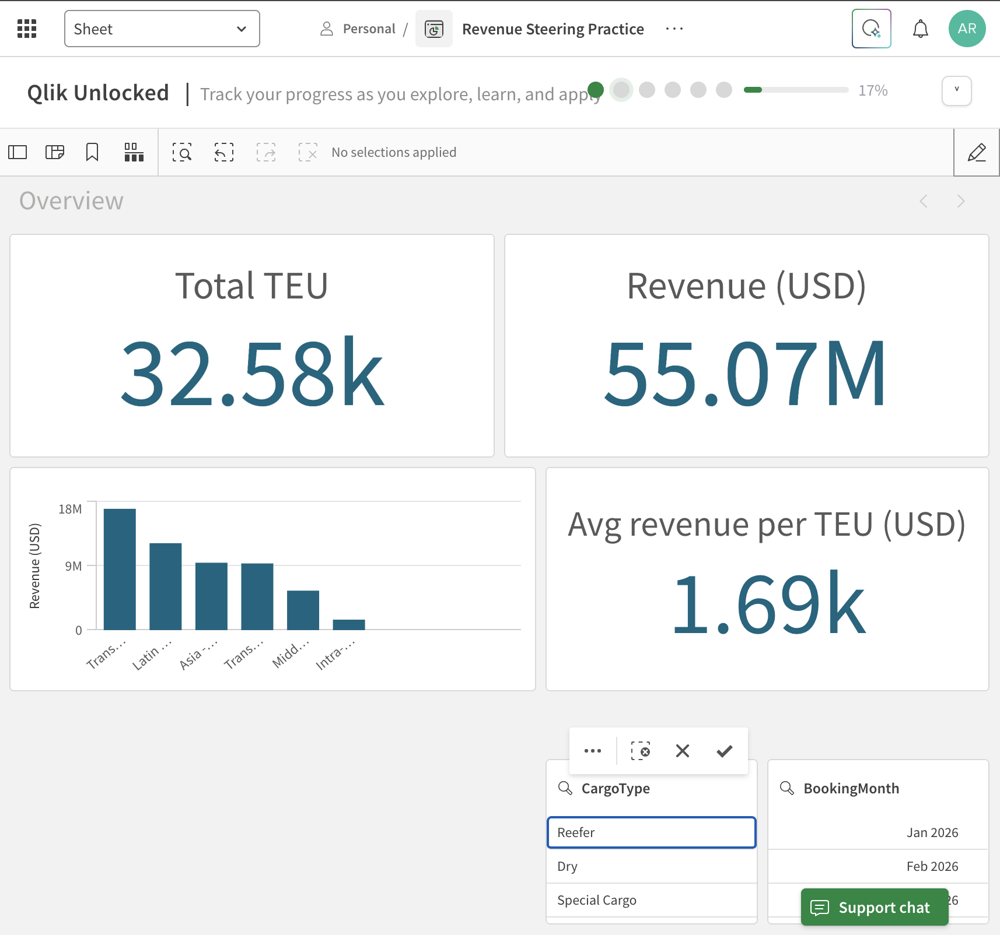
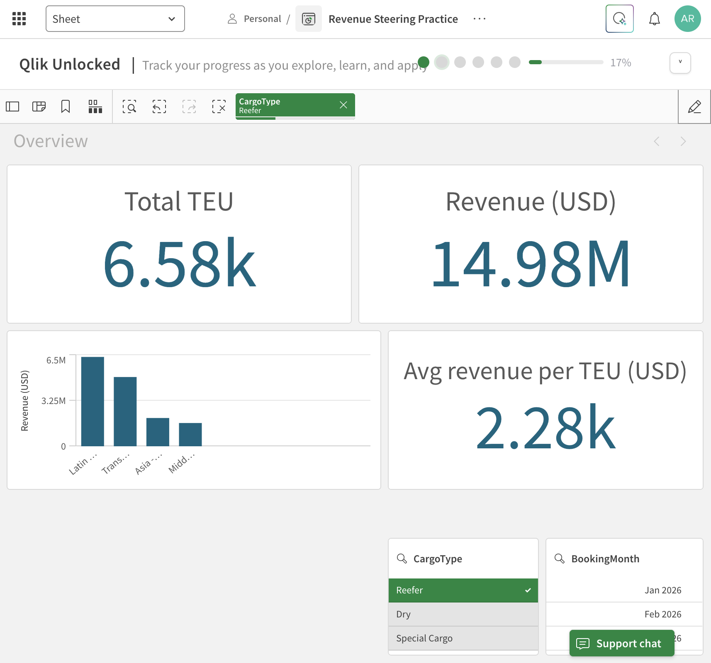
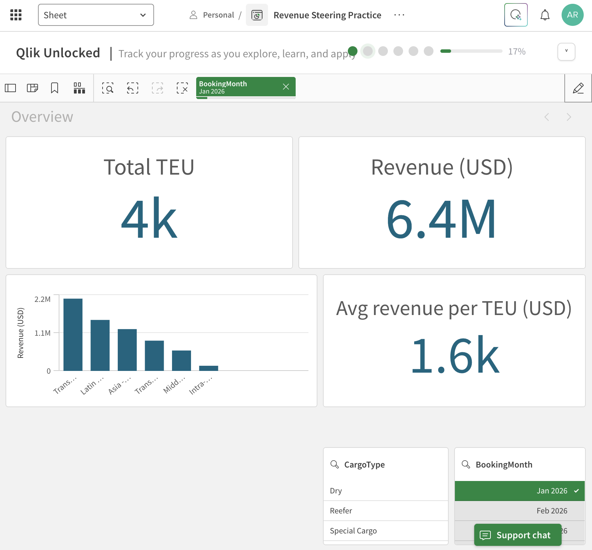

# Qlik Sense Revenue Steering Dashboard

Hands-on learning project: building a revenue steering dashboard for a container shipping business in **Qlik Sense (Qlik Cloud)** — from raw data to management-ready insights.

> **Note:** All data in this project is **fictional practice data** created for learning. Company names, volumes and rates are invented and do not represent any real company.

---

## Business questions

A revenue steering team needs to answer, at a glance:

1. How much did we ship and earn (Jan–Sep 2026)?
2. Which trade lanes and cargo types drive revenue?
3. Are we on target — and where are the gaps?
4. Are sales teams adopting a new quotation tool?

Core logic: **Revenue = Volume (TEU) × Rate (USD per TEU)**, shaped by **mix** (lane, customer, cargo type).

---

## Data model

Source: [`data/Shipping_Revenue_Practice_Data.xlsx`](data/Shipping_Revenue_Practice_Data.xlsx)

| Table | Rows | Description | Links to |
|---|---|---|---|
| Bookings | 327 | Month × trade lane × customer × cargo type, with TEU and rate per TEU | Customers (Customer), Targets (LaneMonthKey) |
| Customers | 15 | Region and segment per customer | Bookings, CampaignAdoption (Region) |
| Targets | 54 | Monthly revenue target per trade lane | Bookings |
| CampaignAdoption | 65 | Weekly adoption of a new quotation tool by region | Customers |

---

## Roadmap

| # | Project | Status |
|---|---|---|
| 0 | Qlik Cloud setup, upload data | ✅ Done |
| 1 | First app: KPIs, revenue by trade lane, filters | ✅ Done |
| 2 | Data model: link Customers + Targets, actual vs target | ⏳ Planned |
| 3 | Revenue Steering dashboard (3 sheets, master items, set analysis) | ⏳ Planned |
| 4 | Campaign adoption report | ⏳ Planned |
| 5 | Storytelling: bookmarks, Qlik story, export to Excel / PowerPoint | ⏳ Planned |

---

## Project 1 — First app: Bookings overview

**Goal:** load booking data and build a first overview sheet with KPIs, a breakdown by trade lane and filters.

### What I did

1. Created a Qlik Cloud app and loaded the **Bookings** table.
2. **Fixed a data type issue:** the Excel month column loaded as a serial number (`46023`). Created a calculated field so months display as real dates:
   ```
   BookingMonth = Date(MonthStart(Month), 'MMM YYYY')
   ```
3. Built three KPIs:

   | KPI | Expression |
   |---|---|
   | Total TEU | `Sum(TEU)` |
   | Revenue (USD) | `Sum(TEU * RatePerTEU_USD)` |
   | Avg revenue per TEU (USD) | `Sum(TEU * RatePerTEU_USD) / Sum(TEU)` |

4. Built a **bar chart** — Revenue by trade lane, sorted descending.
5. Added a **filter pane** for CargoType and BookingMonth.
6. Cleaned labels and sorting to make the sheet management-ready.

### Screenshots

**Overview (no selection)**


**Reefer selected**


**Data manager — calculated date field**


### Results

| | All cargo | Reefer |
|---|---|---|
| Total TEU | 32.58k | 6.58k |
| Revenue (USD) | 55.07M | 14.98M |
| Avg revenue per TEU | ~1,691 | ~2,278 |

### Key insight

**Reefer is ~20% of containers but ~27% of revenue.** Each reefer container earns about **35% more** than the average container, and reefer volume is concentrated on four lanes (Latin America, Transatlantic, Asia–North Europe, Middle East–India). Mix matters as much as volume.

### What I learned

- Dimensions vs measures, and aggregation (`Sum`)
- Writing expressions — multiply row by row first, then sum
- Fixing data types with a calculated field
- Qlik's associative selections (green / white / grey)
- Edit mode vs analysis mode; labels and sorting for management readers

---

## Project 2 — Data model: actual vs target

*Coming soon.*

## Project 3 — Revenue Steering dashboard

*Coming soon.*

## Project 4 — Campaign adoption report

*Coming soon.*

## Project 5 — Storytelling and export

*Coming soon.*

---

## Tools

Qlik Sense (Qlik Cloud Analytics) · Excel · PowerPoint

**Author:** Aravind Radhakrishnan — M.Sc. IT Engineering student, FH Wedel · [LinkedIn](https://www.linkedin.com/in/aravind-radhakrishnan-6679ab209)
